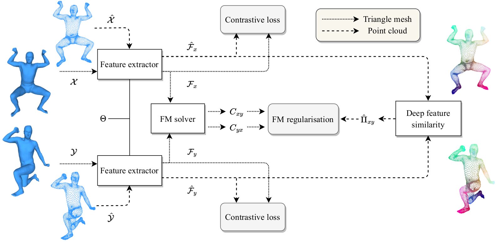

# [Self-Supervised Learning for Multimodal Non-Rigid 3D Shape Matching (CVPR 2023, selected as highlight)](https://arxiv.org/abs/2303.10971)


## Installation
```bash 
conda create -n fmnet python=3.8 # create new viertual environment
conda activate fmnet
conda install pytorch cudatoolkit -c pytorch # install pytorch
pip install -r requirements.txt # install other necessary libraries via pip
```

## Dataset
To train and test datasets used in this paper, please download the datasets from the following links:

- [FAUST](https://drive.google.com/file/d/1RmFxmQlwfNMLwxIUvbDp8xI80fARg1dN/view?usp=share_link)
- [SCAPE](https://drive.google.com/file/d/1ZPrJ7h6B16-LPXw0UVLTMFYXk9qPG9rE/view?usp=share_link)
- [SHREC19](https://drive.google.com/file/d/1phU6xyxm5fIda5dbclH_c44Rm-6WfTug/view?usp=share_link)
- [SURREAL-5K](https://drive.google.com/file/d/1D_FHv7UHHbcXquCR-BYs1w5PJiwtqgkY/view?usp=share_link)
- [SHREC'16](https://github.com/pvnieo/cp2p-pfarm-benchmark)

We thank the original dataset providers for their contributions to the shape analysis community, and that all credits should go to the original authors.

## Data preparation
For data preprocessing, we provide *[preprocess.py](preprocess.py)* to compute all things we need (LBO eigenfunctions, geodesic distance matrix).
Here is an example for FAUST remesh data. The provided data should have a subfolder **off** containing all triangle mesh files.
```python
python preprocess.py --data_root ../data/FAUST_r/ --no_normalize --n_eig 128
```

## Train
To train a model for 3D shape matching. You only need to write or use a YAML config file. 
In the YAML config file, you can specify everything around training. 
Here is an example to train.
```python
python train.py --opt options/train.yaml 
```
You can visualize the training process via TensorBoard.
```bash
tensorboard --logdir experiments/
```

## Test
After finishing training. You can evaluate the model performance using a YAML config file similar to training.
Here is an example to evaluate.
```python
python test.py --opt options/test.yaml 
```

## Pretrained models
You can find the pre-trained models on SURREAL-5k dataset in [checkpoints](checkpoints) for reproducibility.

## Acknowledgement
The implementation of DiffusionNet is modified from [the official implementation](https://github.com/nmwsharp/diffusion-net), 
the computation of the FM unsupervised loss and FM solvers are modified from [SURFMNet-pytorch](https://github.com/pvnieo/SURFMNet-pytorch)
and [DPFM](https://github.com/pvnieo/DPFM), the Sinkhorn normalization is adapted from [tensorflow implementation](https://github.com/google/gumbel_sinkhorn).  
We thank the authors for making their codes publicly available.

## Citation
If you find the code is useful, please cite the following paper
```bibtex
@inproceedings{cao2023,
title = {Self-Supervised Learning for Multimodal Non-Rigid 3D Shape Matching},
author = {D. Cao and F. Bernard},
year  = {2023},
booktitle = {IEEE Conference on Computer Vision and Pattern Recognition (CVPR)}
}
